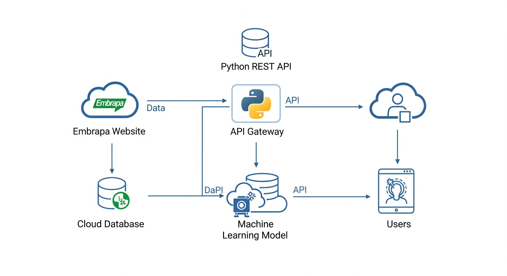

# 🍇 API de Dados Vitivinícolas da Embrapa — Online & Offline

Este projeto foi desenvolvido como parte do **Tech Challenge – Fase 1** do curso de **Machine Learning Engineering da FIAP**.

A proposta é uma **API REST em Python com FastAPI** para consulta de dados da vitivinicultura brasileira disponibilizados originalmente pela **Embrapa**.

O projeto foi estruturado com **duas versões complementares**:

---

## 🧩 Estrutura do Projeto

| Versão     | Descrição                                                                 |
|------------|---------------------------------------------------------------------------|
| `offline`  | Lê exclusivamente dados locais em `.csv`, usada após a queda do site.     |
| `online`   | Tenta obter dados ao vivo via scraping, com fallback automático para CSV. |

---

## 🚀 Links de Deploy (Render)

- 🔗 [API - Versão Offline (Render)](https://seu-link-offline.onrender.com)
- 🔗 [API - Versão Online (Render)](https://seu-link-online.onrender.com)

---

## ✅ Funcionalidades

- Fornecimento de dados da produção, processamento, comercialização, importação e exportação de produtos vitivinícolas
- Modularização do projeto (`main.py`, `extratores_embrapa.py`)
- Swagger UI disponível em `/docs`
- Versão com scraping ao vivo e fallback (quando disponível)

---

## 📂 Estrutura de Pastas

Tech_challenge/
├── offline/
│ ├── dados/
│ │ ├── producao.csv
│ │ ├── processamento.csv
│ │ └── ...etc
│ ├── main.py
│ ├── extratores_embrapa.py
│ └── requirements.txt

├── _pycache_
├── .venv
├── Diagrama.png # Arquitetura da solução
├── dockerfile
├── extratores_embrapa.py
├── main.py
├── README.md
├── render.yaml
└── requirements.txt

---

## 📌 Endpoints disponíveis (ambas as versões)

| Método | Rota               | Descrição                              |
|--------|--------------------|----------------------------------------|
| GET    | `/`                | Mensagem de boas-vindas                |
| GET    | `/producao`        | Produção de uvas                       |
| GET    | `/processamento`   | Dados de processamento                 |
| GET    | `/comercializacao` | Comercialização de produtos            |
| GET    | `/importacao`      | Dados de importação                    |
| GET    | `/exportacao`      | Dados de exportação                    |
| GET    | `/docs`            | Interface Swagger                      |

---

## ⚙️ Como rodar localmente

### Para a versão **Offline**:

    cd offline
    python -m venv .venv
    source .venv/bin/activate           # (ou .venv\Scripts\activate no Windows)
    pip install -r requirements.txt
    uvicorn main:app --reload
    Para a versão Online (se quiser testar scraping/fallback):
    bash
    Copy
    Edit
    cd online
    python -m venv .venv
    source .venv/bin/activate
    pip install -r requirements.txt
    uvicorn main:app --reload
    Acesse: https://obscure-spork-97wrxjprq952xjqj-8000.app.github.dev/  ## Verificar se o API está funcionando
    Acesse: https://obscure-spork-97wrxjprq952xjqj-8000.app.github.dev/docs ## Acessar API via

🗺️ Diagrama de arquitetura

🎥 Vídeo de apresentação 🔗 [Assista aqui]((https://www.loom.com/share/fdb838fc0b71482fb8c2c967478008f0?sid=a5285510-66b7-4d89-b6da-12a69770cc07))

👨‍💻 Autor
Guilherme Donato — [LinkedIn](https://www.linkedin.com/in/guilhermedonatomoraes/)

